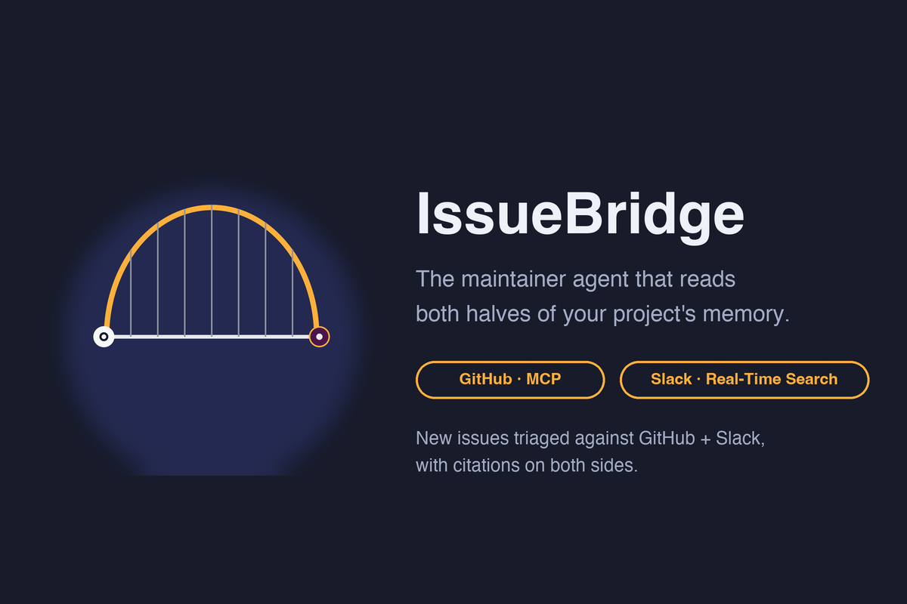
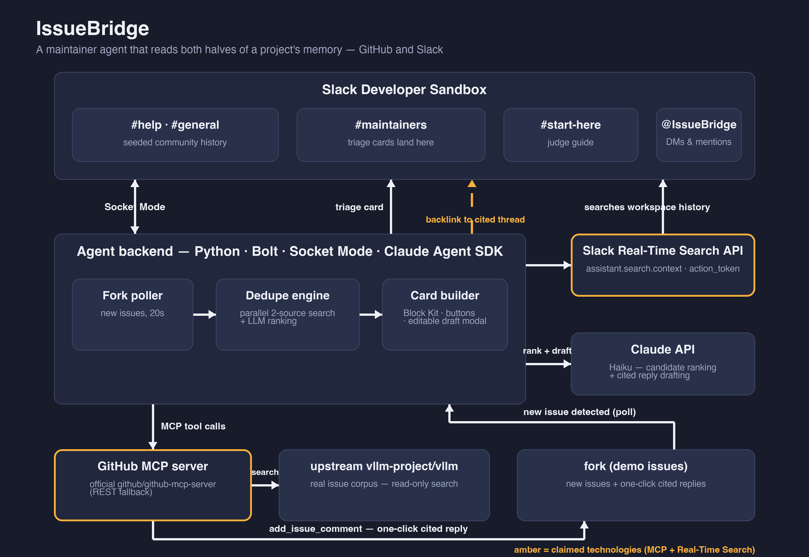

<p align="center">
  
</p>

# IssueBridge

**A maintainer agent that searches your GitHub issues *and* your Slack history — because half your project's answers never made it to GitHub.**

Open-source maintainers already have AI triage for GitHub (Dosu and friends). But in active communities like vLLM's, half the project's knowledge lives in Slack: bugs reported informally in `#help`, workarounds shared in passing, decisions made in a thread that never reaches the tracker. No GitHub-side tool can see that — searching a live workspace in real time wasn't something an external agent could do at all, until Slack's Real-Time Search API. IssueBridge is the agent that closes that gap.

## What it does

- **New-issue triage.** When an issue lands on the repo, IssueBridge checks *both halves* of the project's memory — the upstream `vllm-project/vllm` tracker and the community Slack — and posts a triage card in `#maintainers` with **citations on both sides**: *"this matches closed issue #4821, and it was already answered in #help three days ago."*
- **One-click cited replies.** Each card carries an LLM-drafted maintainer reply citing both sources. Post it as-is, or open it in an **editable modal** and adjust the wording first. A **"Not a duplicate"** button records the human override.
- **The bridge runs both ways.** When a reply is posted to GitHub, IssueBridge drops a note back into the cited Slack thread — the answer's original author learns their fix was reused. Structurally impossible for a GitHub-only tool.
- **Ad hoc Q&A.** DM the agent or @mention it in a channel; it searches both corpora and answers with a `Sources:` footer of clickable citations.

## The two claimed technologies

| Technology | Where it lives | What it does |
|---|---|---|
| **Slack Real-Time Search API** (`assistant.search.context`) | [`rts.py`](rts.py) | Live workspace search, authorized by the `action_token` pulled from each message/mention event — the API's event-scoped permissioning model, not a static credential |
| **Model Context Protocol (MCP)** | [`github_mcp.py`](github_mcp.py) | GitHub access through the official [`github/github-mcp-server`](https://github.com/github/github-mcp-server) — issue search on upstream, `add_issue_comment` on the fork (plain REST available as a fallback) |

## Architecture

<p align="center">
  
</p>

The flow: fork issue → **poller** (20s) → parallel search of **upstream GitHub (MCP)** + **Slack history (RTS)** → **Claude Haiku** ranks candidates and drafts a cited reply → **Block Kit triage card** in `#maintainers` → one click posts the cited comment back to GitHub — and a backlink to the cited Slack thread.

Built with **Bolt for Python**, **Socket Mode**, and the **Claude Agent SDK** (the conversational agent, with custom search tools registered over an in-process MCP server).

## Try it

The demo runs in a Slack developer sandbox seeded with realistic community conversations modeled on real, closed vLLM issues. New issues are filed against [a fork](https://github.com/ManasShouche/vllm) so the demo never touches the real project's tracker.

1. **Ask the agent** (DM or @mention):
   - `Has anyone hit CUDA OOM errors with tensor parallelism?`
   - `How do I fix undefined symbol errors after pip install vllm?`
   - `What's the right max-model-len for AWQ quantization on a 24GB GPU?`
2. **Watch live triage:** [file an issue on the fork](https://github.com/ManasShouche/vllm/issues/new) — a cited triage card appears in `#maintainers` within ~20 seconds.

## Run it yourself

```bash
git clone https://github.com/ManasShouche/issuebridge && cd issuebridge
python3 -m venv .venv && source .venv/bin/activate
pip install -r requirements.txt
cp .env.sample .env       # fill in ANTHROPIC_API_KEY, GITHUB_TOKEN, FORK_REPO
python check_setup.py     # pre-flight: tokens, channels, fork Issues enabled
python seed/seed.py       # seed the community history (once)
slack run                 # or: python3 app.py with SLACK_BOT_TOKEN/SLACK_APP_TOKEN set
```

Create the app from [`manifest.json`](manifest.json) (Slack CLI or [api.slack.com/apps](https://api.slack.com/apps)). The `search:read.public` scope powers Real-Time Search; reinstall after scope changes. Set `GITHUB_MCP_URL` to route GitHub calls through the MCP server.

## Project structure

```
app.py                  Bolt Socket Mode entrypoint — starts the fork poller
poller.py               Watches the fork for new issues (20s)
dedupe.py               Parallel two-source retrieval + Haiku ranking → verdict JSON
rts.py                  Real-Time Search adapter (assistant.search.context)
github_mcp.py           GitHub via MCP server, REST fallback
cards.py                Block Kit triage cards — citations, stats footer, actions
triage.py               New issue → dedupe → card in #maintainers
agent/                  Claude Agent SDK core + tools (GitHub search, Slack search, emoji)
listeners/              Slack event/action handlers — DM, mentions, buttons, modal, App Home
seed/                   17 seeded community threads modeled on real closed vLLM issues
```

## What's next

Multi-repo support · a weekly digest mode for maintainers who want a pull instead of a push · converting a `#help` thread into a GitHub issue with one click · a Marketplace-distributable version with per-workspace OAuth install.

## License

MIT — see [LICENSE](LICENSE).
